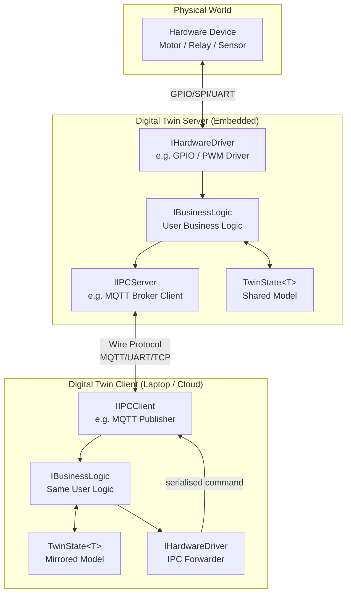
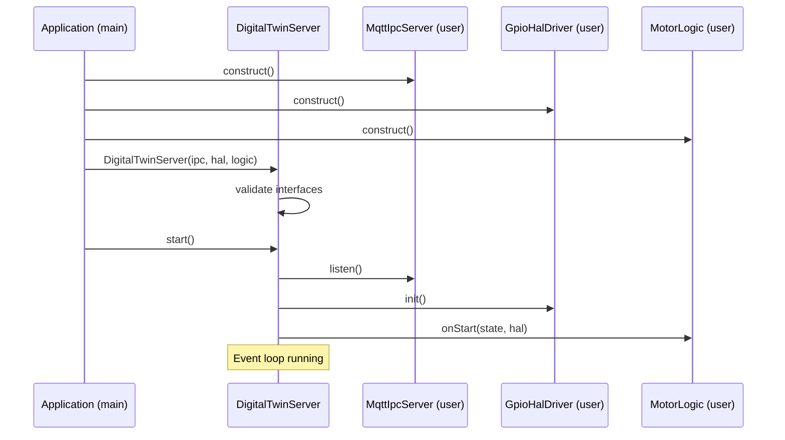
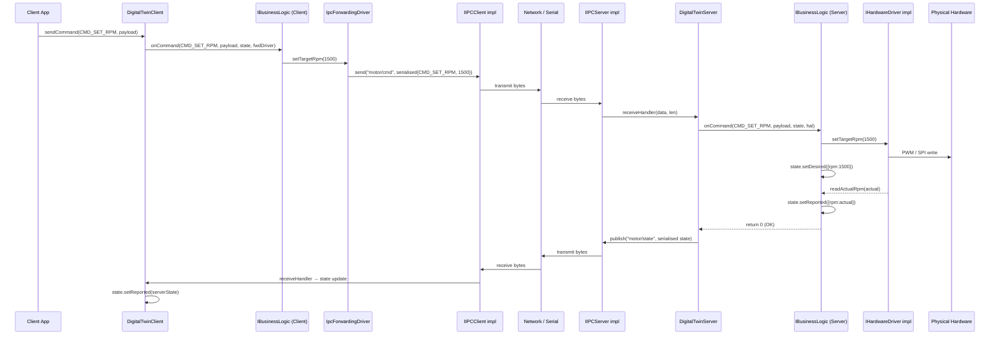

# Digital Twin Framework — High-Level Design (HLD)

**Version:** 1.0  
**Status:** Draft  

---

## Table of Contents

1. [Executive Summary](#1-executive-summary)
2. [Existing Open Source Solutions Survey](#2-existing-open-source-solutions-survey)
3. [HB-MVP Design Pattern Analysis](#3-hb-mvp-design-pattern-analysis)
4. [Architecture Overview](#4-architecture-overview)
5. [Component Breakdown](#5-component-breakdown)
6. [Key Interfaces / API Design](#6-key-interfaces--api-design)
7. [Data Flow](#7-data-flow)
8. [Concurrency & Resource Considerations](#8-concurrency--resource-considerations)
9. [Extensibility & Platform Targets](#9-extensibility--platform-targets)
10. [Design Decisions & Trade-offs](#10-design-decisions--trade-offs)
11. [Glossary](#11-glossary)

---

## 1. Executive Summary

The **Digital Twin Framework** is a lightweight, platform-agnostic C++ library for building digital twins of embedded hardware systems. It enables a 1:1 mirrored relationship between a physical device and a software replica that can be observed, commanded, and reasoned about from any connected environment.

### Goals

| Goal | Description |
|---|---|
| **Platform agnosticism** | Core logic compiles and runs on bare-metal MCUs (STM32, ESP32), Linux SBCs (Raspberry Pi), and desktop/cloud hosts without modification |
| **High code reuse** | Server and Client share the same core types, state machine, and business logic interface; they differ only in which IPC and hardware driver implementations are injected at startup |
| **Small footprint** | No heap allocation in the hot path; no STL containers that pull in heavy runtime overhead; compatible with RTOS environments |
| **Inversion of control** | The framework defines interfaces; the user provides implementations — nothing is hard-coded to a transport protocol or hardware peripheral |
| **Clear, stable API** | Minimal surface area; all extension points are pure abstract C++ interfaces |

### Non-Goals

- A specific wire protocol or serialization format (those are part of user-supplied IPC implementations)
- Cloud device management (provisioning, OTA, fleet management) — out of scope for v1
- A GUI or dashboard — the Client exposes an API; visualization is the user's responsibility

---

## 2. Existing Open Source Solutions Survey

Before committing to a custom design, the following projects were evaluated for relevance, reusability, and fit.

### 2.1 Eclipse Ditto

| Attribute | Detail |
|---|---|
| **Language / runtime** | Java / Akka, runs on JVM |
| **Hosted by** | Eclipse Foundation |
| **Model** | JSON-based "Thing" model with Features, Properties, and Messages |
| **Transport** | HTTP REST, WebSocket, AMQP, MQTT |

**Relevance:** Ditto is a mature, production-grade digital twin platform for cloud deployments. Its "Thing" model (attributes + features + desired/reported state) is conceptually well-aligned with this project's state model. However, Ditto is JVM-only and impractical to run on MCUs. The **desired/reported state duality** (a command says "desired state", the device reports "actual state") is a pattern worth adopting.

**Takeaway:** Adopt the desired/reported state split in the shared state model; do not take a runtime dependency on Ditto.

---

### 2.2 AWS IoT Greengrass

| Attribute | Detail |
|---|---|
| **Language / runtime** | Python/Java/C++ SDKs; Greengrass core runs on Linux |
| **Model** | Device Shadows (JSON documents with `desired` / `reported` / `delta` sections) |
| **Transport** | MQTT over TLS, local IPC via Unix domain sockets |

**Relevance:** Greengrass introduces the concept of **local execution** (Lambda functions at the edge) so the cloud twin can be evaluated locally. Its Device Shadow model is very close to what this framework needs. The C++ SDK is usable but carries significant AWS-specific baggage and requires a Linux environment. Not suitable for bare-metal MCUs.

**Takeaway:** The `desired / reported / delta` shadow model is a proven pattern to reference. The notion of a "shadow document" as a serializable struct maps well to this framework's `TwinState<T>`.

---

### 2.3 Azure Digital Twins + Azure IoT Hub

| Attribute | Detail |
|---|---|
| **Language / runtime** | .NET / REST APIs; IoT Hub has C SDKs |
| **Model** | DTDL (Digital Twins Definition Language) — JSON-LD ontology |
| **Transport** | MQTT, AMQP, HTTPS; device SDK for C |

**Relevance:** Azure IoT Hub's **C device SDK** (`azure-iot-sdk-c`) runs on embedded Linux and some RTOS targets (FreeRTOS, Mbed). It implements the `desired / reported` twin model. However, it requires TLS, a TCP/IP stack, and at minimum ~100 KB flash — too heavy for the smallest MCU targets. DTDL itself is interesting as a machine-readable way to describe a device's capabilities, but adds tooling complexity that is out of scope for v1.

**Takeaway:** Azure's C SDK proves the embedded twin concept is viable in C/C++ but confirms that a custom minimal implementation is needed for ultra-constrained targets. DTDL is worth revisiting in v2 for schema validation.

---

### 2.4 Eclipse Mosquitto / MQTT

| Attribute | Detail |
|---|---|
| **Language / runtime** | C broker; client libraries in C (`mosquitto`), C++ wrappers exist |
| **Protocol** | MQTT 3.1.1 / 5.0 — publish/subscribe, QoS 0/1/2, retained messages |
| **Footprint** | Very small; runs on Raspberry Pi, MQTT clients run on ESP32/STM32 (via `mqtt-c`, `PicoMQTT`) |

**Relevance:** MQTT is the de-facto embedded IoT transport. The framework's `IIPCClient` / `IIPCServer` abstraction is explicitly designed to accommodate an MQTT implementation. Mosquitto's retained-message feature maps directly to the "last known state" broadcast pattern. The framework will not depend on Mosquitto but MQTT should be a first-class reference implementation of the IPC layer.

**Takeaway:** Design IPC interfaces so that an MQTT-backed implementation is a natural fit (topic-per-command, topic-per-state, QoS selection as IPC config).

---

### 2.5 OpenThread

| Attribute | Detail |
|---|---|
| **Language / runtime** | C/C++, bare-metal and RTOS |
| **Protocol** | Thread (IEEE 802.15.4 mesh networking) |
| **Footprint** | ~64–128 KB flash |

**Relevance:** OpenThread is relevant as a potential network transport for the IPC layer on constrained MCUs where Wi-Fi/Ethernet is unavailable. It does not provide a digital twin model. An `IIPCServer`/`IIPCClient` implementation backed by CoAP-over-Thread is a valid future target.

**Takeaway:** Ensure IPC interface design does not assume TCP/IP — byte-stream or datagram-agnostic design accommodates Thread/CoAP and other non-IP transports.

---

### 2.6 PlatformIO

| Attribute | Detail |
|---|---|
| **Type** | Build system / IDE / library registry for embedded C/C++ |
| **Relevance** | Toolchain, not a framework |

**Relevance:** PlatformIO is the natural build and dependency management tool for this framework. It supports Arduino, ESP-IDF, STM32Cube, Mbed, FreeRTOS, and Linux targets from a single `platformio.ini`. This framework should ship as a PlatformIO library and provide example `platformio.ini` configurations for each reference target.

**Takeaway:** Publish the framework as a PlatformIO library. Use PlatformIO's `lib_deps` and build flags to optionally include platform-specific IPC/HAL reference implementations.

---

### 2.7 FreeRTOS / Zephyr RTOS

| Attribute | Detail |
|---|---|
| **Type** | Real-time operating systems |
| **Relevance** | Concurrency primitives for embedded targets |

**Relevance:** Both FreeRTOS and Zephyr provide queues, mutexes, tasks/threads, and timers. The framework's threading model (see §8) must be expressible in terms that map to both POSIX threads (Linux) and RTOS primitives. An abstract `IScheduler` / `IQueue` may be needed in v2; for v1, the framework defers threading to the application.

**Takeaway:** Design framework to be thread-safe when called from a single task/thread; document that the user is responsible for providing appropriate synchronization across threads if multi-threaded access is needed.

---

### 2.8 Summary Table

| Project | Embeddable | C/C++ | Twin Model | IPC Agnostic | Verdict |
|---|---|---|---|---|---|
| Eclipse Ditto | ✗ | ✗ | ✓ | Partial | Inspire model design only |
| AWS Greengrass | Partial (Linux) | ✓ | ✓ | ✗ | Inspire shadow model |
| Azure IoT Hub (C SDK) | Partial | ✓ | ✓ | ✗ | Reference C SDK patterns |
| Mosquitto/MQTT | ✓ | ✓ | ✗ | N/A | First-class IPC implementation |
| OpenThread | ✓ | ✓ | ✗ | N/A | Future IPC implementation |
| PlatformIO | ✓ | ✓ | N/A | N/A | Use as build system |
| FreeRTOS/Zephyr | ✓ | ✓ | ✗ | N/A | Concurrency abstraction target |

**Conclusion:** No existing solution satisfies all goals simultaneously. A custom minimal framework is justified, informed by the shadow model from AWS/Azure and the transport abstraction from MQTT.

---

## 3. HB-MVP Design Pattern Analysis

### 3.1 What is HB-MVP?

**Hardware-Backed Model-View-Presenter (HB-MVP)** is an adaptation of the classic MVP pattern for embedded and IoT systems where the "View" is a physical device (hardware output) rather than a GUI widget.

```
                ┌─────────────────────────────────────────────────┐
                │                HB-MVP Participants               │
                ├───────────┬──────────────────┬───────────────────┤
                │  Model    │  Presenter       │  View (Hardware)  │
                │           │                  │                   │
                │  State    │  Business Logic  │  GPIO / PWM /     │
                │  Commands │  Command Router  │  SPI / I2C / etc. │
                │  Telemetry│  State Machine   │                   │
                └───────────┴──────────────────┴───────────────────┘
```

In HB-MVP:
- **Model** holds the authoritative state of the twin (desired + reported), independent of hardware.
- **Presenter** (business logic) receives commands from the IPC layer, updates the Model, and drives the View (hardware) via an abstraction interface.
- **View** is the `IHardwareDriver` abstraction — it renders the Model's state onto the physical world.

### 3.2 Pros

| Pro | Explanation |
|---|---|
| **Testability** | The Presenter (business logic) can be unit-tested without hardware — inject a mock `IHardwareDriver` |
| **Separation of concerns** | Protocol parsing (IPC), domain logic (Presenter), and I/O (HAL) are isolated |
| **Natural fit for digital twin** | The Model is literally the twin's state; the Client side runs the same Presenter with a mock hardware driver that forwards commands over IPC |
| **Reuse** | Server and Client share Model and Presenter; only the View (hardware driver vs. IPC forwarder) differs — this aligns perfectly with the high code-reuse requirement |
| **Familiar pattern** | Developers with GUI background recognize MVP immediately |

### 3.3 Cons

| Con | Explanation |
|---|---|
| **Indirection overhead** | Virtual dispatch on hot paths (every hardware write goes through a vtable call); negligible on Cortex-M3+ but relevant on very constrained 8-bit targets |
| **State synchronisation complexity** | Desired vs. reported state divergence requires explicit reconciliation logic in the Presenter — adds code complexity |
| **Not standard in embedded** | Most embedded developers are unfamiliar with MVP; onboarding requires explanation |
| **Presenter can become a "God class"** | Without discipline, business logic accumulates in the Presenter, violating single responsibility |

### 3.4 Fit Assessment

HB-MVP is an **excellent structural fit** for this project. The mapping is direct:

| HB-MVP Role | Framework Entity |
|---|---|
| Model | `TwinState<T>` (shared core) |
| Presenter | `IBusinessLogic` (user-provided) |
| View (hardware) | `IHardwareDriver` (user-provided, server side) |
| View (remote) | `IIPCClient` forwarder (client side) |
| Input (commands) | `IIPCServer` (server) / `IIPCClient` (client) |

The pattern is adopted as the primary structural paradigm, with the following adaptation: the `IIPCServer`/`IIPCClient` layer is treated as an additional participant (the "Input Controller") rather than being folded into the Presenter, keeping the Presenter free of transport concerns.

---

## 4. Architecture Overview

### 4.1 Conceptual Layer Diagram

```
┌──────────────────────────────────────────────────────────────────────────────┐
│                          DIGITAL TWIN FRAMEWORK                              │
│                                                                              │
│  ┌──────────────────────────────────────────────────────────────────────┐   │
│  │                         SHARED CORE LIBRARY                          │   │
│  │                                                                       │   │
│  │   TwinState<T>   │   IBusinessLogic   │   CommandDispatcher          │   │
│  │   (Model)        │   (Presenter iface)│   (event/command routing)    │   │
│  └──────────────────────────────────────────────────────────────────────┘   │
│           │                   │                       │                      │
│    ┌──────┴──────┐     ┌──────┴──────┐       ┌───────┴──────┐               │
│    │  IIPCServer │     │  IIPCClient │       │IHardwareDriver│              │
│    │  (interface)│     │  (interface)│       │  (interface)  │              │
│    └──────┬──────┘     └──────┬──────┘       └───────┬───────┘              │
│           │                   │                       │                      │
│  ┌────────┴───────────────────┴───────────────────────┴────────────────┐    │
│  │                        USER-PROVIDED IMPLEMENTATIONS                  │   │
│  │                                                                       │   │
│  │  MqttIpcServer  │  MqttIpcClient  │  GpioHalDriver  │  SimHalDriver  │   │
│  │  UartIpcServer  │  TcpIpcClient   │  PwmHalDriver   │  IpcFwdDriver  │   │
│  └───────────────────────────────────────────────────────────────────────┘  │
└──────────────────────────────────────────────────────────────────────────────┘
```

### 4.2 System Topology



### 4.3 Initialization Flow



---

## 5. Component Breakdown

### 5.1 Shared Core Library

The Shared Core is compiled identically for both the Server and Client. It contains no platform-specific code and no I/O.

#### 5.1.1 `TwinState<T>`

A generic, serialisation-neutral state container following the **desired/reported** split:

- `desired` — the state that has been commanded (written by the Client or local logic)
- `reported` — the state last confirmed by the hardware driver
- `delta()` — returns whether `desired != reported`, indicating a pending reconciliation

`T` is a user-defined plain data struct (no virtual functions, no heap allocation required). Example: `MotorState { int32_t rpm; bool enabled; }`.

The container provides:
- Thread-safe accessors (lightweight spinlock or critical section — platform-injectable)
- A dirty flag / version counter for change detection
- Optional callback registration for state change notifications

#### 5.1.2 `IBusinessLogic`

A pure abstract interface the user implements. It is the **Presenter** in HB-MVP terms. The framework calls its methods on lifecycle events and incoming commands. It receives:
- A reference to `TwinState<T>` (the Model)
- A reference to `IHardwareDriver` (the View) — on the Server this drives real hardware; on the Client it calls the IPC forwarder

The business logic must not contain any platform-specific code — it must be identical on Server and Client.

#### 5.1.3 `CommandDispatcher`

Routes incoming serialised commands (received from the IPC layer) to the appropriate `IBusinessLogic` handler. It:
- Deserialises the command envelope (command ID + payload)
- Validates the command against the registered schema
- Invokes the appropriate `IBusinessLogic::onCommand()` overload
- Returns a status code / response payload to the IPC layer

The dispatcher is intentionally dumb — it does not interpret command semantics.

---

### 5.2 IPC Abstraction Layer

#### 5.2.1 `IIPCServer`

Runs on the embedded device. Responsibilities:
- Listen for incoming connections / messages from remote Clients
- Deliver received commands to the `CommandDispatcher`
- Publish state/telemetry updates to connected Clients
- Optionally authenticate/authorise connections (user-defined)

The framework guarantees that `IIPCServer` is called from a single thread (or RTOS task); re-entrancy is not required from the framework side.

#### 5.2.2 `IIPCClient`

Runs on the Client node. Responsibilities:
- Establish and maintain a connection to the `IIPCServer` implementation
- Send serialised commands to the Server
- Receive state/telemetry publications from the Server and deliver them to the local `CommandDispatcher`
- Report connection health to the framework

---

### 5.3 Hardware Abstraction Layer (HAL)

#### 5.3.1 `IHardwareDriver`

The **View** in HB-MVP. On the Server it wraps real peripheral APIs; on the Client it wraps IPC calls that forward commands to the Server.

The interface is intentionally narrow: it exposes typed read/write operations for the hardware capabilities relevant to the domain (e.g., `setMotorSpeed(rpm)`, `readTemperature()`). It does not expose raw register access — that stays in the concrete driver.

The framework does not prescribe a specific `IHardwareDriver` signature — the user defines it for their domain. The framework provides the injection mechanism and lifecycle management.

---

### 5.4 Digital Twin Server

`DigitalTwinServer` is a thin orchestration class. It:
1. Holds references to the three injected collaborators: `IIPCServer`, `IHardwareDriver`, `IBusinessLogic`
2. Wires them together through `CommandDispatcher` and `TwinState<T>`
3. Implements `start()` / `stop()` / `tick()` lifecycle methods
4. Owns the main event loop (or exposes a `tick()` for cooperative scheduling on bare-metal)

It does **not** contain business logic. It does **not** know about the physical device or the wire protocol.

---

### 5.5 Digital Twin Client

`DigitalTwinClient` is structurally identical to `DigitalTwinServer` — same template, same lifecycle. The difference is purely in what is injected:

| | Server | Client |
|---|---|---|
| IPC | `IIPCServer` (listens for connections) | `IIPCClient` (connects to Server) |
| Hardware driver | Real `IHardwareDriver` (GPIO, PWM, etc.) | `IpcForwardingDriver` (sends IPC commands) |
| Business logic | `IBusinessLogic` (user, same code) | `IBusinessLogic` (user, same code) |

The `IpcForwardingDriver` is a framework-provided adapter that translates hardware driver calls into serialised IPC commands sent via `IIPCClient`. This is the key enabler of code reuse: the same `IBusinessLogic` runs on both sides, unaware of whether it is controlling real hardware or a remote replica.

---

## 6. Key Interfaces / API Design

All interfaces are pure abstract C++ classes. No exceptions are thrown across interface boundaries (error codes are returned instead, for RTOS/no-exception compatibility).

### 6.1 State Types

```cpp
// User-defined state struct — example for a motor controller
struct MotorState {
    int32_t  rpm        = 0;
    bool     enabled    = false;
    float    temperature = 0.0f;
};

// Framework-provided generic twin state container
template<typename T>
class TwinState {
public:
    // Write the desired state (from Client command or local logic)
    void setDesired(const T& state);

    // Write the reported state (from hardware driver after applying command)
    void setReported(const T& state);

    // Read-only access
    const T& desired()  const;
    const T& reported() const;

    // True if desired != reported (pending reconciliation)
    bool hasDelta() const;

    // Register callback — called on any state change (desired or reported)
    // Callback is invoked synchronously on the calling thread
    using StateChangedCallback = void(*)(const TwinState<T>&, void* context);
    void onStateChanged(StateChangedCallback cb, void* context = nullptr);
};
```

### 6.2 `IHardwareDriver`

The user defines this interface for their specific domain. The framework provides the concept:

```cpp
// Framework concept — not a literal base class in v1
// Users define their own IHardwareDriver for their domain
//
// Example for a motor controller domain:
class IMotorDriver {
public:
    virtual ~IMotorDriver() = default;

    // Returns 0 on success, negative error code on failure
    virtual int  init()                         = 0;
    virtual void deinit()                       = 0;

    virtual int  setEnabled(bool enabled)       = 0;
    virtual int  setTargetRpm(int32_t rpm)      = 0;
    virtual int  readActualRpm(int32_t& out)    = 0;
    virtual int  readTemperature(float& out)    = 0;
};
```

### 6.3 `IBusinessLogic`

```cpp
template<typename TState, typename TDriver>
class IBusinessLogic {
public:
    virtual ~IBusinessLogic() = default;

    // Called once after framework initialisation, before the event loop starts
    virtual void onStart(TwinState<TState>& state, TDriver& driver) = 0;

    // Called when a command arrives from the IPC layer
    // commandId: application-defined enum/integer
    // payload:   raw bytes; business logic owns deserialisation
    // Returns 0 on success, negative error code to send back to caller
    virtual int onCommand(uint32_t commandId,
                          const uint8_t* payload, size_t payloadLen,
                          TwinState<TState>& state,
                          TDriver& driver) = 0;

    // Called periodically by the framework (rate configured at init)
    // Used for polling hardware, reconciling desired/reported delta, etc.
    virtual void onTick(TwinState<TState>& state, TDriver& driver) = 0;

    // Called on graceful shutdown
    virtual void onStop(TwinState<TState>& state, TDriver& driver) = 0;
};
```

### 6.4 `IIPCServer`

```cpp
class IIPCServer {
public:
    virtual ~IIPCServer() = default;

    // Initialise transport (open socket, subscribe to MQTT topics, etc.)
    // Returns 0 on success
    virtual int init() = 0;
    virtual void deinit() = 0;

    // Start listening for incoming messages.
    // The framework provides a receive handler — the implementation must call
    // it for every complete message received.
    using ReceiveHandler = void(*)(const uint8_t* data, size_t len, void* ctx);
    virtual int startListening(ReceiveHandler handler, void* ctx) = 0;

    // Publish a message to all connected Clients (e.g., state update)
    // topicOrChannel: implementation-defined routing key
    virtual int publish(const char* topicOrChannel,
                        const uint8_t* data, size_t len) = 0;

    // Poll for pending messages (used in cooperative / bare-metal mode)
    // Returns number of messages processed, or negative error code
    virtual int poll() = 0;

    // Connection health
    virtual bool isConnected() const = 0;
};
```

### 6.5 `IIPCClient`

```cpp
class IIPCClient {
public:
    virtual ~IIPCClient() = default;

    virtual int  init()   = 0;
    virtual void deinit() = 0;

    // Connect to the IIPCServer endpoint (URL, address, device path, etc.)
    virtual int connect(const char* endpoint) = 0;
    virtual int disconnect() = 0;

    // Send a command to the Server
    virtual int send(const char* topicOrChannel,
                     const uint8_t* data, size_t len) = 0;

    // Register handler for messages received from the Server (state updates)
    using ReceiveHandler = void(*)(const uint8_t* data, size_t len, void* ctx);
    virtual int subscribe(const char* topicOrChannel,
                          ReceiveHandler handler, void* ctx) = 0;

    // Poll (cooperative mode)
    virtual int poll() = 0;

    virtual bool isConnected() const = 0;
};
```

### 6.6 `DigitalTwinServer`

```cpp
template<typename TState, typename TDriver>
class DigitalTwinServer {
public:
    struct Config {
        uint32_t tickIntervalMs = 100;  // onTick call interval
    };

    // All three collaborators are injected — no ownership transfer
    DigitalTwinServer(IIPCServer&                        ipcServer,
                      TDriver&                           hardwareDriver,
                      IBusinessLogic<TState, TDriver>&   businessLogic,
                      const Config&                      config = {});

    int  start();   // init all layers, start event loop (or prepare for tick)
    void stop();    // graceful shutdown

    // For cooperative / bare-metal scheduling — call from main loop
    void tick();

    // Direct access to the state for application-level inspection
    TwinState<TState>& state();
};
```

### 6.7 `DigitalTwinClient`

```cpp
template<typename TState, typename TDriver>
class DigitalTwinClient {
public:
    struct Config {
        const char* serverEndpoint  = nullptr;
        uint32_t    tickIntervalMs  = 100;
        uint32_t    reconnectMs     = 5000;
    };

    // IpcForwardingDriver adapts TDriver calls to IPC commands
    DigitalTwinClient(IIPCClient&                        ipcClient,
                      TDriver&                           forwardingDriver,
                      IBusinessLogic<TState, TDriver>&   businessLogic,
                      const Config&                      config = {});

    int  start();
    void stop();
    void tick();

    TwinState<TState>& state();

    // Send an explicit command (alternative to going through business logic)
    int sendCommand(uint32_t commandId,
                    const uint8_t* payload, size_t payloadLen);
};
```

---

## 7. Data Flow

### 7.1 Command Path: Client → Hardware



### 7.2 Telemetry Path: Hardware → Client (Periodic)

```
[HAL::readTemperature()]
        │
        ▼
[IBusinessLogic::onTick()]
  state.setReported({ temperature: 72.3 })
        │
        ▼
[TwinState<T> — dirty flag set]
        │
        ▼
[DigitalTwinServer — detects delta]
        │
        ▼
[IIPCServer::publish("motor/telemetry", serialised)]
        │  (wire)
        ▼
[IIPCClient — receive handler]
        │
        ▼
[DigitalTwinClient — state.setReported()]
        │
        ▼
[TwinState<T>::onStateChanged() callback]
        │
        ▼
[Client Application — update UI / log / alert]
```

### 7.3 Desired/Reported Reconciliation

```
┌──────────────┐        ┌──────────────┐
│   desired    │        │   reported   │
│  rpm = 1500  │ ──────►│  rpm = 1200  │
└──────────────┘  delta └──────────────┘
                    │
                    ▼
         IBusinessLogic::onTick()
         detects hasDelta() == true
                    │
                    ▼
         HAL::setTargetRpm(desired.rpm)
                    │
                    ▼
         wait for hardware to settle
                    │
                    ▼
         HAL::readActualRpm() → 1500
                    │
                    ▼
         state.setReported({ rpm: 1500 })
         → hasDelta() == false
```

---

## 8. Concurrency & Resource Considerations

### 8.1 Threading Model

The framework supports two scheduling modes:

| Mode | Description | Use Case |
|---|---|---|
| **Cooperative (tick-based)** | Application calls `DigitalTwinServer::tick()` from its main loop. No threads created by framework. | Bare-metal without RTOS; FreeRTOS with single task |
| **Threaded** | `start()` spawns an internal thread/task that drives the event loop at `tickIntervalMs`. | Linux, POSIX, Zephyr with threading support |

The mode is selected at compile time via a preprocessor flag (`DT_COOPERATIVE_MODE`), avoiding virtual dispatch overhead for the scheduler.

### 8.2 Memory Layout

| Component | Stack | Heap | Static |
|---|---|---|---|
| `TwinState<T>` | 0 | 0 | `2 × sizeof(T)` + metadata (~16 B) |
| `CommandDispatcher` | ~128 B (decode buffer) | 0 | Command table (user-sized) |
| `IIPCServer` impl | Implementation-defined | Optional | Interface pointer |
| `IHardwareDriver` impl | Implementation-defined | Optional | Interface pointer |
| `DigitalTwinServer` | ~64 B | 0 | Config struct |

For a typical motor controller with `MotorState` (12 bytes), the core framework static footprint is **under 512 bytes** excluding the IPC and HAL implementations.

### 8.3 No Dynamic Allocation in Core

The core library (`TwinState`, `CommandDispatcher`, `DigitalTwinServer/Client`) does **not** call `new`, `delete`, `malloc`, or `free`. All buffers are either stack-allocated or statically sized at compile time (template parameters). IPC and HAL implementations may allocate as they see fit — that is outside the framework's control.

### 8.4 RTOS Compatibility

| RTOS | Notes |
|---|---|
| **FreeRTOS** | Cooperative mode preferred. Threaded mode requires `configUSE_TASK_NOTIFICATIONS` or a semaphore wrapper around `tick()` |
| **Zephyr** | Cooperative mode or Zephyr thread via `k_thread_create` wrapping `tick()` loop |
| **Mbed OS** | `EventQueue` can drive `tick()` |
| **Bare-metal** | Cooperative mode; `tick()` called from `while(1)` or SysTick ISR callback |
| **Linux / macOS / Windows** | Threaded mode with POSIX threads or `std::thread` |

### 8.5 Interrupt Safety

`TwinState<T>` setters must not be called from ISR context. The recommended pattern is to write hardware readings to a volatile staging variable in the ISR and read them from `onTick()` in task context.

---

## 9. Extensibility & Platform Targets

### 9.1 Adding a New IPC Implementation

1. Implement `IIPCServer` (for device side) and/or `IIPCClient` (for host side)
2. Implement `init()`, `deinit()`, `startListening()`, `publish()`, `poll()`, `isConnected()`
3. Inject at construction: `DigitalTwinServer server(myIpcServer, myHal, myLogic)`

No framework code is modified. No recompilation of the shared core.

**Example:** UART-based IPC for STM32 ↔ Raspberry Pi:

```cpp
class UartIpcServer : public IIPCServer {
    UART_HandleTypeDef* huart_;
    uint8_t rxBuf_[256];
    // ...
public:
    explicit UartIpcServer(UART_HandleTypeDef* huart) : huart_(huart) {}
    int init() override { /* HAL_UART_Init */ return 0; }
    int startListening(ReceiveHandler h, void* ctx) override { /* DMA RX */ return 0; }
    int publish(const char*, const uint8_t* d, size_t n) override {
        return HAL_UART_Transmit(huart_, d, n, 100) == HAL_OK ? 0 : -1;
    }
    int poll() override { /* check DMA complete flag */ return 0; }
    bool isConnected() const override { return true; }
};
```

### 9.2 Adding a New Hardware Driver

1. Define the domain interface (e.g., `IMotorDriver`) — pure abstract
2. Implement it for the target hardware
3. Implement an `IpcForwardingDriver` variant that translates calls to IPC commands

```cpp
// Server-side (real hardware)
class StmPwmMotorDriver : public IMotorDriver {
    TIM_HandleTypeDef* htim_;
public:
    int setTargetRpm(int32_t rpm) override {
        uint32_t arr = rpmToTimerArr(rpm);
        __HAL_TIM_SET_AUTORELOAD(htim_, arr);
        return 0;
    }
    // ...
};

// Client-side (forwards over IPC)
class MotorIpcForwarder : public IMotorDriver {
    IIPCClient& ipc_;
public:
    int setTargetRpm(int32_t rpm) override {
        uint8_t buf[8];
        serialise(CMD_SET_RPM, rpm, buf);
        return ipc_.send("motor/cmd", buf, sizeof(buf));
    }
    // ...
};
```

### 9.3 Reference Platform Matrix

| Platform | IPC Option | HAL Option | Mode |
|---|---|---|---|
| STM32F4 + FreeRTOS | UART / CAN bus | STM32 HAL GPIO/PWM | Cooperative |
| ESP32 | MQTT over Wi-Fi | ESP-IDF GPIO/PWM | Threaded |
| Raspberry Pi (server) | MQTT / UNIX socket | Linux sysfs GPIO / pigpio | Threaded |
| Linux / macOS (client) | MQTT / TCP socket | `IpcForwardingDriver` | Threaded |
| Native unit test | `MockIpcServer` | `MockHardwareDriver` | Cooperative |

### 9.4 Adding a New Business Logic Domain

Business logic is entirely user-owned. To add a new domain (e.g., LED strip controller):
1. Define `LedState` struct
2. Define `ILedDriver` interface
3. Implement `IBusinessLogic<LedState, ILedDriver>` (shared, platform-agnostic)
4. Provide `LedStripDriver` (server) and `LedIpcForwarder` (client)

The framework core is unchanged. Zero framework modifications required.

---

## 10. Design Decisions & Trade-offs

### 10.1 Templates over Runtime Polymorphism for Core

**Decision:** `DigitalTwinServer<TState, TDriver>` is a class template; `TwinState<T>` is a class template.  
**Rationale:** Avoids vtable overhead and enables the compiler to inline state accessors. On a Cortex-M0+ with 16 KB RAM, eliminating virtual dispatch in the hot path (tick at 100 Hz) saves ~10–20 ns per call and avoids one level of indirection.  
**Trade-off:** Longer compilation time; template error messages can be difficult to read. Mitigated by providing clear `static_assert` checks with descriptive messages.

---

### 10.2 IPC and HAL as Pure Virtual Interfaces (not Templates)

**Decision:** `IIPCServer`, `IIPCClient`, `IHardwareDriver` are conventional virtual interfaces, not templates.  
**Rationale:** These are user-extension points. Virtual interfaces provide a well-understood extension mechanism, easy mocking in tests, and no requirement to expose implementation details in headers.  
**Trade-off:** One vtable dispatch per IPC send/receive and HAL call. Acceptable since IPC and HAL calls are already dominated by I/O latency.

---

### 10.3 No Built-in Serialisation

**Decision:** The framework does not mandate or provide a serialisation format.  
**Rationale:** Serialisation is inseparably coupled to the transport. An MQTT implementation might use MessagePack; a UART implementation might use COBS-framed binary; a test might use raw memcpy. Mandating a format would either over-constrain users or force a dependency on a serialisation library (e.g., nanopb, CBOR).  
**Trade-off:** Users must implement serialisation in their IPC layer. Mitigated by providing reference implementations and a serialisation utilities header with common patterns.

---

### 10.4 Desired/Reported State Split

**Decision:** `TwinState<T>` carries both `desired` and `reported` copies.  
**Rationale:** Directly inspired by AWS Device Shadows and proven in production IoT systems. Provides a clear model for asynchronous hardware that does not respond instantaneously. Simplifies business logic: "apply desired, poll reported, publish delta".  
**Trade-off:** Doubles state memory usage (`2 × sizeof(T)`). For small state structs (< 64 bytes) this is negligible.

---

### 10.5 No Exception Handling

**Decision:** All methods return integer error codes; no exceptions are thrown.  
**Rationale:** Many embedded toolchains compile with `-fno-exceptions` by default. FreeRTOS and bare-metal environments do not support exception unwinding. Using exceptions would prevent use on the most constrained targets.  
**Trade-off:** Error handling is more verbose. An optional `Result<T, E>` wrapper (inspired by Rust's `Result`) can be layered on top for callers that prefer monadic error handling.

---

### 10.6 Single-Header Option

**Decision:** The framework should be distributable as a single-header `digital_twin.hpp` for easy integration alongside the split-header+source library form.  
**Rationale:** Embedded projects often have complex build systems. A single-header distribution removes the need to add source files to the build.  
**Trade-off:** Longer compile times per translation unit. Acceptable given the small total size of the framework.

---

## 11. Glossary

| Term | Definition |
|---|---|
| **Digital Twin** | A software representation of a physical device that mirrors the device's state and exposes its control interface |
| **HB-MVP** | Hardware-Backed Model-View-Presenter — an adaptation of MVP where the "View" is physical hardware controlled through an abstraction interface |
| **IPC** | Inter-Process Communication — in this framework, any transport mechanism between the Client and Server (MQTT, TCP, UART, etc.) |
| **IIPCServer** | Framework interface for the transport listener running on the embedded device |
| **IIPCClient** | Framework interface for the transport initiator running on the host/cloud |
| **IHardwareDriver** | User-defined pure abstract interface for domain-specific hardware operations (e.g., motor, LED, relay) |
| **IBusinessLogic** | User-defined pure abstract interface for application logic; the Presenter in HB-MVP |
| **TwinState\<T\>** | Framework-provided generic container holding `desired` and `reported` copies of the user-defined state type `T` |
| **Desired state** | The state that has been commanded but not yet confirmed by hardware |
| **Reported state** | The state last confirmed by reading from the hardware driver |
| **Delta** | The difference between desired and reported state; non-zero delta indicates a pending hardware reconciliation |
| **IpcForwardingDriver** | A framework-provided adapter that implements `IHardwareDriver` by serialising calls as IPC commands; used on the Client side |
| **CommandDispatcher** | Framework component that routes deserialized IPC messages to the appropriate `IBusinessLogic::onCommand()` handler |
| **Cooperative mode** | Scheduling mode where the framework performs no work autonomously; the application drives progress by calling `tick()` |
| **Threaded mode** | Scheduling mode where `start()` spawns an OS thread/RTOS task to drive the event loop |
| **HAL** | Hardware Abstraction Layer — wraps platform-specific peripheral APIs behind the `IHardwareDriver` interface |
| **RTOS** | Real-Time Operating System (e.g., FreeRTOS, Zephyr, Mbed OS) |
| **PlatformIO** | Build system and library registry for embedded C/C++; the recommended distribution channel for this framework |
| **DTDL** | Digital Twins Definition Language — a JSON-LD schema format used by Azure Digital Twins to describe device capabilities |
| **COBS** | Consistent Overhead Byte Stuffing — a framing scheme for binary protocols over byte-stream transports like UART |
